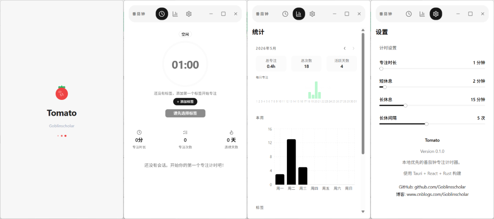

# 番茄 (Tomato)

> 本地优先的番茄钟专注计时器 — 轻量、现代、无干扰。

番茄是一款基于 **Tauri v2** 构建的桌面端番茄钟应用，帮助你保持专注、管理时间。所有数据 100% 本地存储在 SQLite 中，无需账户、无需联网、无遥测收集。



---

## 功能概览

- **番茄钟计时** — 专注 / 短休息 / 长休息三阶段切换，支持自动过渡
- **自定义时长** — 自由调整专注、短休、长休的分钟数
- **标签系统** — 每次专注可指定标签，追踪时间去向
- **统计看板** — 日统计、周趋势图、月热力图、标签分布饼图
- **会话历史** — 完整的专注与休息记录
- **系统托盘** — 关闭窗口至托盘，计时在后台继续运行
- **Widget 模式** — 迷你置顶窗口，专注时仅显示计时器
- **全局快捷键** — `Ctrl+Shift+F` 切换主窗口 / Widget
- **桌面通知** — 专注完成或休息结束时自动弹窗提醒
- **崩溃恢复** — 意外退出后自动重置计时器状态
- **睡眠容错** — 电脑从休眠中唤醒后自动检测并完成超时的计时会话

---

## 技术栈

| 层级 | 技术 |
|------|------|
| 桌面框架 | Tauri v2 (2.11.1) |
| 前端框架 | React 19 + TypeScript + Vite 6 |
| 样式 | TailwindCSS v4 + shadcn/ui |
| 状态管理 | Zustand 5 |
| 路由 | react-router 7 |
| 图表 | Recharts + 自定义 SVG |
| 后端语言 | Rust (1.95.0) |
| 数据库 | SQLite (sqlx 0.8 + chrono) |
| 系统插件 | 通知 / 全局快捷键 (Tauri Plugin v2) |
| 包管理 | pnpm (前端) + Cargo (Rust) |

---

## 架构概览

```
用户操作 → Zustand Store → invoke() → Rust Command
  ├─ 计时器状态机转换
  ├─ SQLite 持久化（会话 / 计时器状态 / 设置）
  └─ 系统 API（通知 / 托盘 / 快捷键）
  → TimerStatusResponse → Zustand Store → React 重新渲染
  → useTimerDisplay RAF (60fps) → TimerDisplay / TimerProgress
```

- **Rust 持有全部数据权限** — 前端通过 `invoke()` 调用，从不直接操作 SQLite
- **计时精度** — Rust 维护 UTC `target_end`，前端用 RAF 60fps 计算倒计时
- **崩溃恢复** — `timer_state` 表做检查点，启动时自动处理未完成会话

---

## 快速开始

### 前置依赖

- Rust 1.95+（[安装 Rust](https://rustup.rs/)）
- Node.js 20+
- pnpm
- WebView2（Windows 10+ 已预装）
- macOS / Linux 用户需额外安装 Tauri v2 系统依赖

### 运行开发模式

```bash
pnpm install
cargo tauri dev
```

### 构建发行版

```bash
cargo tauri build
```

构建产物位于 `src-tauri/target/release/bundle/`。

---

## 关于本项目

番茄 (Tomato) 是一个 **Vibe Coding** 项目。

本项目的全部代码均通过 **Claude Code** 辅助开发完成。从初始的脚手架搭建、计时器状态机与 SQLite 数据库设计、React 前端界面开发，到系统托盘集成、全局快捷键、Widget 模式等桌面端高级功能，以及最终的打包发布 —— 整个过程均由 Claude AI 在人类开发者的需求描述和审核下生成。

Vibe Coding 是一种新兴的开发范式：开发者用自然语言描述需求和架构方向，AI 生成具体的代码实现。这种方式极大加速了从想法到产品的转化过程，使得个人开发者也能快速构建高质量的桌面应用。

源码完全开放，欢迎参考和贡献。


